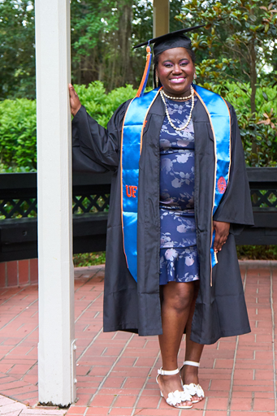

# My First Coding Assignment

Assignment 1 for MMC5277 - Git and GitHub

## About Me
I'm 32 years old and recently graduated from the University of Florida with a degree in Media Production, Management, and Technology. Outside of school and work, I do stand-up comedy and I'm a Unitarian Universalist. I have a girlfriend and a cat named Duncan — he's a terror, but I love him.

## Past Coding Experience
Like a lot of millennials, I had a cringe-y MySpace page that used HTML. It crashed constantly, and I'm pretty sure I gave my friends viruses trying to build a Top 50 Friends list. Other than that, I don't have much coding experience.

## Career Goals
1. Work at a university to get those sweet State of Florida benefits.
2. Work in a university's communications department.